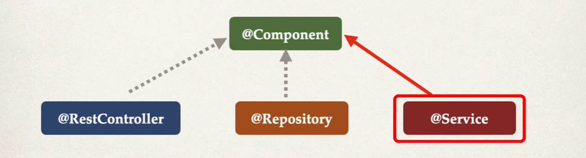
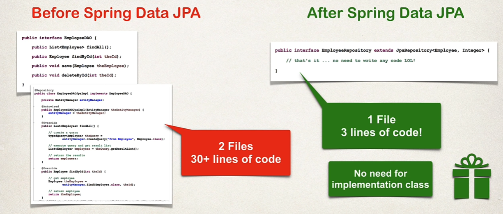
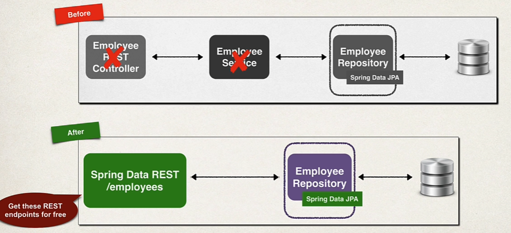

## REST Services
* REST: **RE**presentational **S**tate **T**ransfer
* Lightweight approach for communicating between applications
* The client and server applications can use **ANY** programming language
* REST application can use any data format
* Commonly see XML and JSON
* REST calls can be made over HTTP
* REST is language independent

## JSON Data Format
* **J**avascript **O**bject **N**otation
* JSON is most popular and modern
* Lightweight data format for storing and exchanging data
* It is just plain text data
* Language independent
* Curley braces define objects in JSON
* Object members are name / value pairs (delimited by colons)
* Names (keys) is always in double-quotes
* JSON Values:
    * Numbers: No quotes
    * String: In double quotes
    * Boolean: true, false
    * Nested JSON Objects
    * Array
    * null

## REST HTTP Basics
* Most common use of REST is over HTTP
* Leverage HTTP methods for CRUD operations

Name | Description |
--- | --- |
***POST*** | Create a new entity|
***GET*** | Read a list of entities or single entity |
***PUT*** | Update an existing entity |
***DELETE*** | Delete an existing entity |

* HTTP Request Message:
    * Request line: the HTTP command
    * Header veriables: request metadata
    * Message body: contents of message
* HTTP Response Message:
    * Response line: Server protocol and status code
    * Header veriables: Response metadata
    * Message body: contents of message

Name | Description |
--- | --- |
***100-199*** | Informational |
***200-299*** | Successful |
***300-399*** | Redirection |
***400-499*** | Client Error |
***500-599*** | Server Error |

## MIME Content Type
* The message format is described by MIME content type
    * **M**ultipurpose **I**nternet **M**ail-**E**xtension
* Basic Syntax: type/sub-type
* Examples:
    * text/html, text/plain, application/json, application/xml

## Basic Hello World REST Service Example
```Java
@RestController
@RequestMapping("/test")
public class DemoRestController {
    // add code for the "/hello" endpoint
    @GetMapping("/hello")
    public String sayHello(){
        return "Hello World!";
    }
}
```

## Java JSON Data Binding
* POJO -> Plain Old Java Object
* Data binding is the process of converting JSON data to Java POJO
* JSON data binding with **Jackson**
    * Jackson handles data binding between JSON and Java POJO
    * Spring Boot Starter Web automatically includes dependency for Jackson
* By default, Jackson will call appropriate getter/setter method
* Convert JSON to Java POJO .. call setter methods on POJO
    * Jackson calls the setXXX methods. It does Not access internal private fields directly. It only calls existing setter methods !!!
* Conver Java POJO to JSON ... call geter methods on POJO
    * Jackson will do this work
* When building Spring REST application
    * Spring will automatically handle Jackson integration
    * JSON data being passed to REST controller is converted to POJO
    * Java object being returned from REST controller is converted to JSON
    * Happens automatically behind the scene

```Java
@RestController
@RequestMapping("/api")
public class StudentRestController {
    @GetMapping("/students")
    public List<Student> getStudents(){
        List<Student> list = new ArrayList<Student>();
        list.add(new Student("Anil", "Ipek"));
        list.add(new Student("Gamze", "Ipek"));
        list.add(new Student("Hatice", "Ipek"));

        // Spring REST and Jackson will automatically convert POJOs to JSON
        return list;
    }
}
```

## Path Variables
```Java
@RestController
@RequestMapping("/api")
public class StudentRestController {

    private List<Student> studentList;

    @PostConstruct
    public void loadData(){
        studentList = new ArrayList<Student>();
        studentList.add(new Student("Anil", "Ipek"));
        studentList.add(new Student("Gamze", "Ipek"));
        studentList.add(new Student("Hatice", "Ipek"));
    }

    @GetMapping("/students/{studentId}")
    public Student getStudentById(@PathVariable int studentId){
        // By default, variables must match
        return studentList.get(studentId);
    }
}
```

## Spring Boot REST Exception Handling
* Create a custom error response class
```Java
public class StudentErrorResponse {
    private int status;
    private String message;
    private long timeStamp;
    // ... constructors
    // ... getters / setters
}
```
* Create a custom exception class
```Java
public class StudentNotFoundException extends RuntimeException{

    public StudentNotFoundException(String message) {
        super(message);
    }

    public StudentNotFoundException(String message, Throwable cause) {
        super(message, cause);
    }

    public StudentNotFoundException(Throwable cause) {
        super(cause);
    }
}
```
* Update REST service to throw exception if student not found
```Java
@GetMapping("/students/{studentId}")
public Student getStudentById(@PathVariable int studentId){
    if( (studentId >= studentList.size()) || (studentId < 0)){
        throw new StudentNotFoundException("Student id not found - " + studentId);
    }

    // By default, variables must match
    return studentList.get(stu  dentId);
}
```
* Add an exception handled method using **@ExceptionHandler**
```Java
@ExceptionHandler
public ResponseEntity<StudentErrorResponse> handleException(StudentNotFoundException exc){
    // Create a StudentErrorResponse
    StudentErrorResponse error = new StudentErrorResponse();

    error.setStatus(HttpStatus.NOT_FOUND.value());
    error.setMessage(exc.getMessage());
    error.setTimeStamp(System.currentTimeMillis());

    // Return ResponseEntity
    return new ResponseEntity<>(error, HttpStatus.NOT_FOUND);
}

@ExceptionHandler
public ResponseEntity<StudentErrorResponse> handleException(Exception exc){
    StudentErrorResponse error = new StudentErrorResponse();

    error.setStatus(HttpStatus.BAD_REQUEST.value());
    error.setMessage(exc.getMessage());
    error.setTimeStamp(System.currentTimeMillis());

    return new ResponseEntity<>(error, HttpStatus.BAD_REQUEST);
}
```

## Global Excepiton Handling
* Exception handler code is only for the specific REST controller. Can't be reused by other controllers
* We needg global exception handlers
* Centralizes exception handling
* @Controller Advice is perfect for global exception handling
    * Real-time us of AOP
    * Pre-process request to controllers
    * Post-process response to handle exceptions
```Java
@ControllerAdvice
public class StudentRestExceptionHandler {

    @ExceptionHandler
    public ResponseEntity<StudentErrorResponse> handleException(StudentNotFoundException exc){
        // ...
    }

    @ExceptionHandler
    public ResponseEntity<StudentErrorResponse> handleException(Exception exc){
        // ...
    }
}
```

## Rest API Design
1. Review API requirements
1. Identify main resource / entity
    * /employees: Convention is to use plural form of resource
    * /api/employees
1. Use HTTP methods to assign action on resource
* Example API:
    * Task: Create a REST API  for the Employee Directory
    * REST clients should be able to:
        * Get a list of employee: /api/employees
        * Get a single employee by id: /api/employees/{employeeId}
        * Add a new employee: /api/employees
        * Update an employee: /api/employees
        * Delete an employee: /api/employees/{employeeId}
* DO NOT DO THIS
    * /api/employeeList
    * /api/deleteEmployee
    * These are REST anti-patterns, bad practice
    * Don't include actions in the endpoint

## Service Layer
* Service Facade desing pattern
* Intermediate layer for custom business logic
* Integrate data from multiple sources (DAO/repositories)
* Spring provides the @Service annotation. @Service applied to Service implementations.
* Spring will automatically register the Service implementation

* Process:
    1. Define Service interface
    1. Define Service implementation
        * Intect DAO
* We don't use @Transactional at DAO layer. It will be handled at Service layer

```Java
public interface EmployeeService {
    List<Employee> findAll();
}
```

```Java
@Service
public class EmployeeServiceImpl implements EmployeeService{
    private EmployeeDao employeeDao;

    public EmployeeServiceImpl(EmployeeDao employeeDao){
        this.employeeDao = employeeDao;
    }

    @Override
    public List<Employee> findAll() {
        return employeeDao.findAll();
    }
}
```


## Employee REST API/Service
```Java
@RestController
@RequestMapping("/api")
public class EmployeeRestController {
    private EmployeeService employeeService;

    // inject EmployeeDao ( Constructor Injection )
    @Autowired
    public EmployeeRestController(EmployeeService employeeService){
        this.employeeService = employeeService;
    }

    // expose "/employee" and return a list of employees
    @GetMapping("/employees")
    public List<Employee> getEmployees(){
        return employeeService.findAll();
    }

    @GetMapping("/employees/{employeeId}")
    public Employee getEmployee(@PathVariable int employeeId){
         Employee employee = employeeService.findById(employeeId);

         if(employee == null)
             throw new RuntimeException("Employee id not found - " + employeeId);

         return employee;
    }

    @PostMapping("/employees")
    public Employee addEmployee(@RequestBody Employee theEmployee){
        theEmployee.setId(0);
        Employee dbEmployee = employeeService.save(theEmployee);

        return dbEmployee;
    }

    @PutMapping("/employees")
    public Employee updateEmployee(@RequestBody Employee theEmployee){
        Employee employee = employeeService.save(theEmployee);
        return employee;
    }

    @DeleteMapping("/employees/{employeeId}")
    public String deleteEmployeeById(@PathVariable int employeeId){
        Employee tempEmployee = employeeService.findById(employeeId);

        if(tempEmployee == null)
            throw  new RuntimeException("Employee id not found - " + employeeId);

        employeeService.deleteById(employeeId);
        return "Deleted employee id: " + employeeId;
    }
}
```

## Spring Data JPA
* Create DAO and just plug in your entity type and primary key
* It will give you a CRUD implementation for free
* Helps to minimize boilerplate DAO code
* More than 70% reduction in code ... depending on use case
* Spring Data JPA provides the interface JpaRepository
* Extend JpaRepository interface and use your repository in your app
* Advanced Features:
    * Extending and adding custom queries with JPQL
    * Query Domain Specific Language (Query DSL)
    * Defining custom methods (low-level-coding)



```Java
public interface EmployeeRepository extends JpaRepository<Employee, Integer> {
    // no need to write any code
}
```

## Spring Data REST in Spring Boot
* Spring will give you a REST CRUD implementation 
    * Helps to minimize boilerplate REST code !!!
    * No new coding
* Spring Data REST will expose these endpoints
    * Get a list of employee: /employees
    * Get a single employee by id: /employees/{employeeId}
    * Add a new employee: /employees
    * Update an employee: /employees/{employeeId}
    * Delete an employee: /employees/{employeeId}
* Spring Data REST will scan your project for JpaRepository
* Expose REST APIs for each entity type for your ** JpaRepository**
* By default, it will create endpoints based on entity type
    * entity: employee --> "/employees" plural form

```Xml
<dependency>
    <groupId>org.springframework.boot</groupId>
    <artifactId>spring-boot-starter-data-rest</artifactId>
</dependency>
```
* For Spring Data REST, you only need 3 items
    1. Entity
    1. JpaRepository
    1. Maven POM Dependency

```properties
spring.data.rest.base-path=/api # set base path
spring.data.rest.default-page-size=3 # default page size
```

