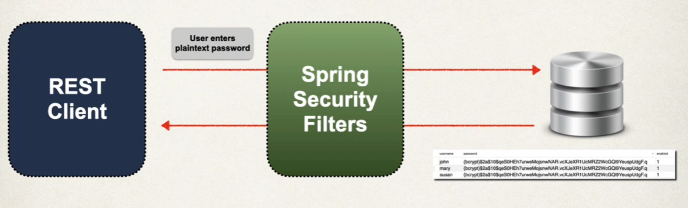
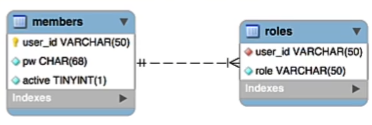

## Spring Security
* It defines a framework for security
* Implemented using Servlet filters in the background
* Two methods of securing an app:
    1. Declarative
    1. Porgrammatic
* Servlet Filters are used to pre-process / post-process web request
* Servlet Filters can route web requests based on security logic
* Spring provides a bulk of security functionality with servlet filters


* **Authentication**: Check user id and password with credentials stored in app / db
* **Authorization**: Check to see if user has an authorized role

```Xml
<dependency>
    <groupId>org.springframework.boot</groupId>
    <artifactId>spring-boot-starter-data-security</artifactId>
</dependency>
```
* This will automagically secure all endpoints for application
* You can override defualt user name and generated password

## Example
```Java
@Configuration
public class DemoSecurityConfig {

    @Bean
    public InMemoryUserDetailsManager userDetailsManager(){
        UserDetails john = User.builder()
                .username("john")
                .password("{noop}test123")
                .roles("EMPLOYEE")
                .build();

        UserDetails mary = User.builder()
                .username("mary")
                .password("{noop}test123")
                .roles("EMPLOYEE", "MANAGER")
                .build();

        UserDetails susan = User.builder()
                .username("susan")
                .password("{noop}test123")
                .roles("EMPLOYEE", "MANAGER", "ADMIN")
                .build();

        return new InMemoryUserDetailsManager(john, mary, susan);
    }
}
```


* Since we defined our users here, Spring Boot will Not use the user/pass from the application.properties file

## Restrict URLs based on Roles


```Java
@Bean
public SecurityFilterChain filterChain(HttpSecurity http)  throws Exception{
    http.authorizeHttpRequests(configurer ->
            configurer
                    .requestMatchers(HttpMethod.GET, "/api/employees").hasRole("EMPLOYEE")
                    .requestMatchers(HttpMethod.GET, "/api/employees/**").hasRole("EMPLOYEE")
                    .requestMatchers(HttpMethod.PUT, "/api/employees").hasRole("MANAGER")
                    .requestMatchers(HttpMethod.POST, "/api/employees").hasRole("MANAGER")
                    .requestMatchers(HttpMethod.DELETE, "/api/employees/**").hasRole("ADMIN")
    );

    // use HTTP basic authentication
    http.httpBasic(Customizer.withDefaults());

    // disable Cross Site Request Forgery (CSRF)
    // in general, not required for statless REST APIs that use POST, PUT, DELETE and/or PATCH
    http.csrf(csrf -> csrf.disable());
    
    return http.build();
}
```

## JDBC Authentication
* Spring Security can read user account info from database
* By default, you have to follow Spring Security's predefined table schemas


## BCrypt Encryption
* The best practice is store passwords in an encrypted foramt
* Spring Security recommends using the popular bcrypt algorithm
* bcrypt:
    * Performs one-way encrypted hashing
    * Adds a random salt to the password for additional protection
    * Includes support to defeat brute force attacks



* The password from db is **NEVER** decrypted
* Because bcrypt is a **one-way** encryption algorithm

## JDBC Authentication Custom Tables
* If we have our own custom tables, tell spring how to query your custom tables
* Provide query to find user by user name
* Provide query to find authorities / roles by user name


```Java
    // add support for JDBC
    @Bean
    public UserDetailsManager userDetailsManager(DataSource dataSource){
        JdbcUserDetailsManager jdbcUserDetailsManager = new JdbcUserDetailsManager(dataSource);

        // define query to retrieve a user by username
        jdbcUserDetailsManager.setUsersByUsernameQuery(
                "select user_id, pw, active from members where user_id=?");

        // define query to retrieve the authorities / roles by username
        jdbcUserDetailsManager.setAuthoritiesByUsernameQuery(
                "select user_id, roles from roles where user_id=?");

        return jdbcUserDetailsManager;
    }

```