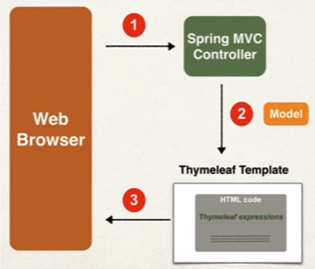
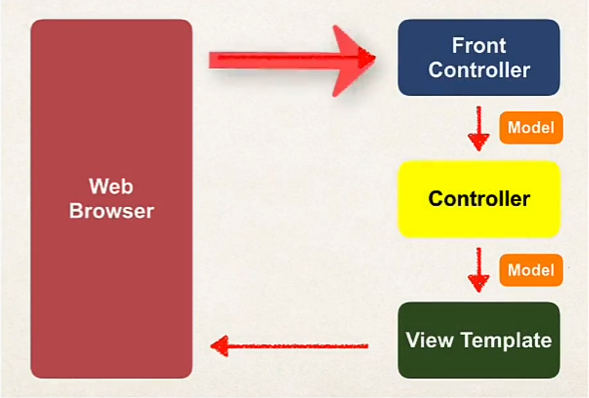
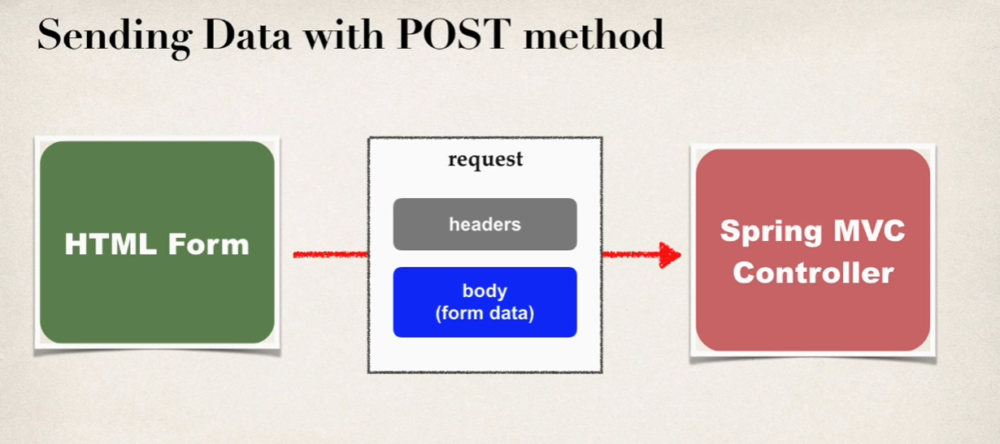

## Thymleaf Template Engine
* Thymeleaf is Java templating engine
* Commonly used to generate the HTML views for web apps
* It is a general purpose templating engine
* Include dynamic content from Thymeleaf expressions
* In a web app, Thymeleaf is processed on the server
* Result included in HTML returned to browser 



* For web apps, Thymeleaf templates have a .html extension
* Additional Features
    * Looping and conditionals
    * CSS and JavaScript integration
    * Template layouts and fragments

* Basic hello world app

```Java
@Controller
public class DemoController {

    @GetMapping("/hello")
    public String sayhello(Model theModel){

        theModel.addAttribute("theDate", new java.util.Date());
        return "helloworld";
    }
}
```
```Html
<!DOCKTYPE html>
<html xmlns:th="http://www.thymeleaf.org">
<head>
    <title>Thymeleaf Demo</title>
</head>
<body>
    <p th:text="'Time on the server is' + ${theDate}"\>

</body>
</html>
```

## Thymleaf and CSS
* You have the option of using:
    1. Local CSS file as part of your project
    1. Referencing remote CSS files
* Spring Boot will look for static resources in the directory
    * src/main/resources/static
    * You can create your own custom sub-directories under static folder

```html
    <link rel="stylesheet" th:href="@{css/style.css}"/>
```

## Spring MVC Behind the Scenes
* Fron controller known as **DispatcherServlet**
    * Part of the Spring Framework
    * Already developed by Spring Dev Team
    * It delegates the request to the Controller
* You will create:
    * **M**odel Objects
    * **V**iew Templates
    * **C**ontroller Classes

* Controller
    * Contains your business logic
    * Handle the request
    * Store/Retrieve data
    * Place data in model
    * Send to appropriate view template

* View Template
    * Recommended: Thymleaf
    * Developer creates a page
        * Displays data



## Simple Form Eaxmple
* FormController
```Java
@Controller
public class FormController {
    @RequestMapping("/showForm")
    public String showForm(){
        return "form";
    }
    @RequestMapping("/processForm")
    public String processForm(){
        return "p-form";
    }
}
```
```Html
<!DOCKTYPE html>
<html xmlns:th="http://www.thymeleaf.org">
<head>
    <meta charset="UTF-8">
    <title>Form Controller Demo</title>
</head>
<body>
    <form th:action="@{processForm}" method="GET"/>
        <input type="text" name="studentName" placeholder="Enter the name"/>
        <input type="submit">
    </form>
</body>
</html>
```
```Html
<!DOCKTYPE html>
<html xmlns:th="http://www.thymeleaf.org">
<head>
    <meta charset="UTF-8">
    <title>Process Form</title>
</head>
<body>
    <p>Student name: <span th:text="${param.studentName}"/></p>
</body>
</html>
```

## Adding Data to Spring MVC Model 
* The model is a container for your application data
* In your Controller
    * You can put anything in the model
    * string, objects, info from database, etc...
* Your view page can access data from the model
* Example:
```Java
@RequestMapping("/processForm")
public String processForm(HttpServletRequest request, Model model){
    String name = request.getParameter("studentName");
    name = name.toUpperCase();
    String message = "Hi! " + name;

    model.addAttribute("name", name);
    model.addAttribute("message", message);
    return "p-form";
}
```

## @RequestParam Annotation
* Spring will read param from request and bind it to veriable
* Example:
```Java
// Spring does this work behind the scenes!
String name = request.getParameter("studentName");
```

```Java
@RequestMapping("/processForm")
public String processForm(@RequestParam("studentName") String name, Model model){
    name = name.toUpperCase();
    String message = "Hi! " + name;

    model.addAttribute("name", name);
    model.addAttribute("message", message);
    return "p-form";
}
```

## @GetMapping And @PostMapping
* Get: Request data from given resource
    * Good for debugging
    * Bookmark or email URL
    * Limitations on data lenght
* Post: Submits data to given resource
    * Can't bookmark or email URL
    * No limitations on data lenght
    * Can also send binary data
* Sendin data with GET method
    * theURL?field1=value1&field2=value2
* @RequestMapping handles ALL HTTP methods
* @RequestMapping(path="/path", method=RequestMethod.GET)
    * This mapping **only** handles GET method
    * Any other HTTP REQUEST method will get rejected
* Sending Data with POST method
    * Data is passed in the body of HTTP request message



## MVC Form Data Bingding
* Spring MVC forms can make use of data binding
* Automatically setting / retrieving data from a Java object / bean
* Before you show the form, you must add a model attribute
* This is a bean that will hold form data for the data binding
* When form is **loaded** Spring MVC will read student from the model, then call
* When form is **submitted** Spring MVC will create a new Student instance and add to the model, then call
* Example:
```Java
public class Student {
    private String firstName;
    private String lastName;
    
    public Student(){}
    
    public String getFirstName() {
        return firstName;
    }
    public String getLastName() {
        return lastName;
    }
    public void setFirstName(String firstName) {
        this.firstName = firstName;
    }
    public void setLastName(String lastName) {
        this.lastName = lastName;
    }
}
```

```Java
@Controller
public class StudentController {

    @GetMapping("/showStudentForm")
    public String showForm(Model theModel){
        Student theStudent = new Student();

        theModel.addAttribute("student", theStudent);
        return "student-registration-form";
    }

    @PostMapping("/processStudentForm")
    public String processStudentForm(@ModelAttribute("student") Student theStudent){

        System.out.println("theSudent: " + theStudent.getFirstName() + " " + theStudent.getLastName());
        return "confirmation";
    }
}
```

```Html
<!DOCKTYPE html>
<html xmlns:th="http://www.thymeleaf.org">
<head>
    <meta charset="UTF-8">
    <title>Student Registration Form</title>
</head>
<body>
    <form th:action="@{/processStudentForm}" th:object="${student}" method="POST"/>
        First name: <input type="text" th:field="${student.firstName}"/>
        <br><br>
        Last name: <input type="text" th:field="${student.lastName}"/>
        <br><br>
        <input type="submit" value="Submit">
    </form>
</body>
</html>
```

```Html
<!DOCKTYPE html>
<html xmlns:th="http://www.thymeleaf.org">
<head>
    <meta charset="UTF-8">
    <title>Student Confirmation</title>
</head>
<body>
    <h1>Student Confirmation Page</h1>
    <p>This student is confirmed: <span th:text="${student.firstName} + ' ' + ${student.lastName}"/></p>
</body>
</html>
```

* Note: *{firstName} is **shortcut syntax** for: ${student.firstName}

## Drop-Down-Lists
```Html
<select th:field="${student.country}">
    <option th:value="Brazil">Brazil</option>
    <option th:value="France">France</option>
    <option th:value="Germany">Germany</option>
    <option th:value="India">India</option>
</select>
```

```Html
<select th:field="${student.country}">
    <option th:each="tempCountry : ${countries}" th:value="${tempCountry}" th:text="${tempCountry}"/>
</select>
```

## Radio-Buttons
```Html
<input type="radio" th:field="${student.favoriteLanguage}"
                    th:each="tempLanguage : ${languages}"
                    th:value="${tempLanguage}"
                    th:text="${tempLanguage}" />
```

## Checkboxs
```Html
<input type="checkbox"  th:field="${student.favoriteSystems}"
                        th:each="system : ${systems}"
                        th:value="${system}"
                        th:text="${system}"/>
```

## Data injection from application.properties
```properties
countries=Brazil,France,Germany,India,Mexico,Spain,United States
```
```Java
// Injection
@Value("${countries}")
public List<String> countries;
```


